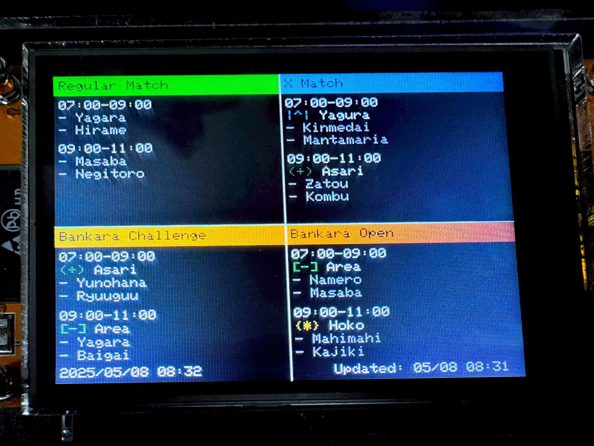

# esp32-splatoon3-schedule

Splatoon3のバトルスケジュール（ナワバリ、Xマッチ、バンカラチャレンジ、バンカラオープン）をESP32とTFT液晶（例: ESP32-2432S028R + ILI9341）で表示するプロジェクトです。

- WiFi経由でAPIからスケジュール情報を取得します。
- 4分割画面で現在・次回のルール、ステージ、時間を表示します。
- ルール名・ステージ名は日本語→英語変換に対応しています。
- 画面下部に現在時刻と最終更新時刻を表示します。

## ハードウェア要件

- ESP32（例: ESP32-2432S028R）
- 320x240 TFT液晶（ILI9341等、TFT_eSPIライブラリ対応）
- WiFi環境

## ソフトウェア要件

- Arduino IDE
- ライブラリ:
  - [TFT_eSPI](https://github.com/Bodmer/TFT_eSPI)
  - [ArduinoJson](https://arduinojson.org/)
  - WiFi, HTTPClient（ESP32標準）

## 使い方

1. `splatoon3_schedule.ino` をArduino IDEで開きます。
2. WiFi設定（`ssid`, `password`）を自分の環境に合わせて書き換えます。
3. 必要なライブラリをインストールします。
4. ESP32に書き込みます。

## 機能

- Splatoon3の4種バトル（Turf War, X Battle, Anarchy Challenge, Anarchy Open）の現在・次回スケジュールを表示
- ルール名・ステージ名を日本語→英語変換
- ルールごとに色分け・シンボル表示
- 画面下部に現在時刻・最終更新時刻を表示
- 10分ごとに自動更新

## 画面イメージ

- 左上: Turf War（ナワバリ）
- 右上: X Battle（Xマッチ）
- 左下: Anarchy Challenge（バンカラチャレンジ）
- 右下: Anarchy Open（バンカラオープン）
- 各象限に現在・次回の時間/ルール/ステージを表示
- 下部に現在時刻・最終更新時刻

## ルール・ステージ対応表

### ルール

| 記号   | 日本語             | 英語             |
|--------|--------------------|------------------|
|        | ナワバリバトル     | Turf War         |
| [-]    | ガチエリア         | Splat Zones      |
| \|^\|    | ガチヤグラ         | Tower Control    |
| {*}    | ガチホコバトル     | Rainmaker        |
| (+)    | ガチアサリ         | Clam Blitz       |

### ステージ

| 日本語                 | 英語                    |
|------------------------|-------------------------|
| ユノハナ大渓谷         | Scorch Gorge            |
| ゴンズイ地区           | Eeltail Alley           |
| ヤガラ市場             | Hagglefish Market       |
| マテガイ放水路         | Undertow Spillway       |
| ナンプラー遺跡         | Um'ami Ruins            |
| ナメロウ金属           | Mincemeat Metalworks    |
| クサヤ温泉             | Brinewater Springs      |
| タラポートショッピングパーク | Barnacle & Dime    |
| ヒラメが丘団地         | Flounder Heights        |
| マサバ海峡大橋         | Hammerhead Bridge       |
| キンメダイ美術館       | Museum d'Alfonsino      |
| マヒマヒリゾート＆スパ | Mahi-Mahi Resort        |
| 海女美術大学           | Inkblot Art Academy     |
| チョウザメ造船         | Sturgeon Shipyard       |
| ザトウマーケット       | Mako Mart               |
| スメーシーワールド     | Wahoo World             |
| コンブトラック         | Humpback Pump Track     |
| マンタマリア号         | Manta Maria             |
| タカアシ経済特区       | Crableg Capital         |
| オヒョウ海運           | Shipshape Cargo Co.     |
| バイガイ亭             | Bayside Bowl            |
| ネギトロ炭鉱           | Bluefin Depot           |
| カジキ空港             | Marlin Airport          |
| リュウグウターミナル   | Dragon Palace Terminal  |

## 参考API
- [spla3.yuu26.com](https://spla3.yuu26.com/)
